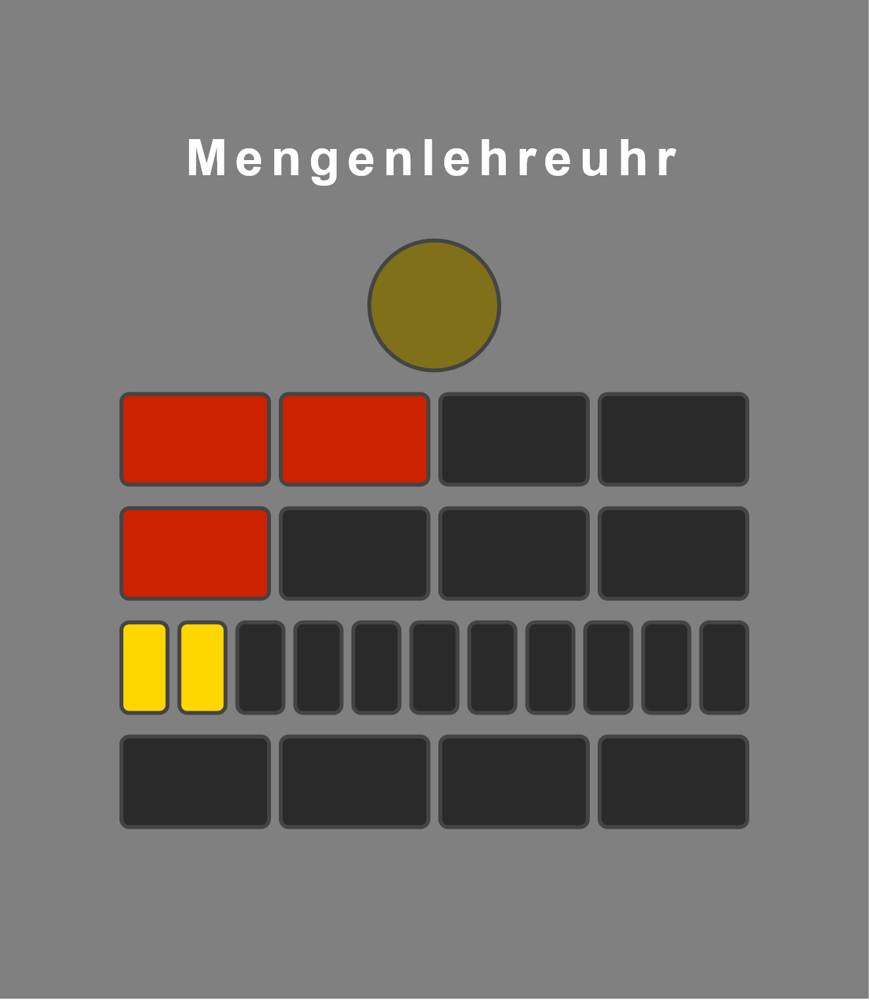

# Berlin Clock

A full-stack implementation of the [Berlin Clock](https://en.wikipedia.org/wiki/Mengenlehreuhr) (Mengenlehreuhr).

The clock displays the current time using lit lamps in a base-5 system:

- **Top circle** — blinks every second (on = even, off = odd)
- **Row 1** — 4 red lamps, each = 5 hours
- **Row 2** — 4 red lamps, each = 1 hour
- **Row 3** — 11 lamps, each = 5 minutes (lamps 3, 6, 9 are red; rest yellow)
- **Row 4** — 4 yellow lamps, each = 1 minute



## Stack

| Layer    | Technology                        |
|----------|-----------------------------------|
| Backend  | C# · ASP.NET Core Minimal API (.NET 8) |
| Frontend | Svelte + TypeScript (Vite)        |

## Prerequisites

- [.NET 8 SDK](https://dotnet.microsoft.com/download/dotnet/8.0)
- [Node.js 18+](https://nodejs.org/)

## Scripts

All dev tasks are handled by [`run.sh`](run.sh) at the project root.

### Start both servers

```bash
bash run.sh start
```

Starts the backend (`http://localhost:5050`) and the Vite dev server (`http://localhost:5173`) concurrently. Press `Ctrl+C` to stop both.

### Stop both servers

```bash
bash run.sh stop
```

Kills any processes running on the backend ports (5000, 5001) and the frontend port (5173).

### Run tests

```bash
bash run.sh test
```

Stops running services, runs backend unit tests (`dotnet test`), and runs the frontend TypeScript type check (`npm run check`).

### Build for production

```bash
bash run.sh build
```

Builds the backend in Release mode and compiles the frontend bundle.

## API

The backend exposes a single endpoint:

```
GET http://localhost:5050/time
```

Response:

```json
{
  "seconds": true,
  "hoursTop":     [true, true, false, false],
  "hoursBottom":  [true, false, false, false],
  "minutesTop":   [true, true, true, false, false, false, false, false, false, false, false],
  "minutesBottom":[true, false, false, false]
}
```

## Project Structure

```
berlin-clock/
├── backend/
│   ├── BerlinClock.Api/
│   │   ├── BerlinClock.cs          # Clock logic (pure, stateless)
│   │   ├── Program.cs              # HTTP server + /time endpoint
│   │   └── BerlinClock.Api.csproj
│   ├── BerlinClock.Tests/
│   │   ├── BerlinClockTests.cs     # Unit tests for clock logic
│   │   └── BerlinClock.Tests.csproj
│   └── BerlinClock.sln
├── frontend/
│   └── src/
│       ├── App.svelte              # Clock UI component
│       ├── app.css
│       ├── main.ts
│       ├── services/
│       │   └── ApiService.ts       # Fetches time from backend
│       ├── types/
│       │   └── ClockState.ts       # TypeScript types for clock state
│       └── utils/
│           └── clockUtils.ts       # Lamp computation helpers
├── run.sh                          # start | stop | test | build
└── README.md
```
